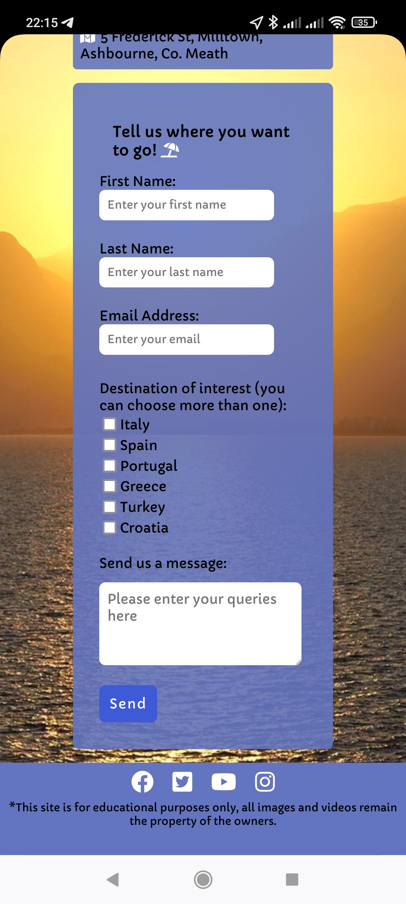
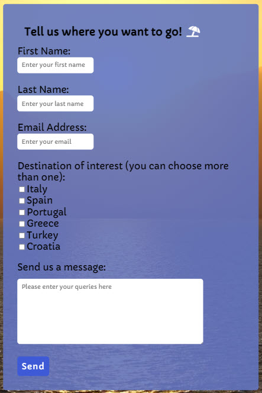
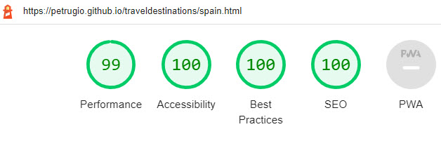

<h1 align="center">Travel Destination</h1>

View the repository in GitHub
<a href="https://github.com/petrugio/traveldestinations" target="_blank" rel="noopener">here</a>

View the live project
<a href="https://petrugio.github.io/traveldestinations/" target="_blank" rel="noopener">here</a>

# Table of Contents

* [UX](#ux)
    * [User Stories](#user-stories)
    * [Using the five planes of UX design](#using-the-five-planes-of-ux-design)
* [Features](#features)
    * [Existing Features](#existing-features)
    * [Features left to implement](#features-left-to-implement)
* [Testing](#testing)
    * [Navigation Links](#navigation-links)
    * [Responsive Design](#responsive-design)
    * [Validator Testing](#validator-testing)
        * [HTML5](#html5)
        * [CSS3](#css3)
        * [Lighthouse](#lighthouse)
        * [WebAIM](#webaim)
    * [Browser Testing](#browser-testing)
* [Bugs](#bugs)
    * [Fixed Bugs](#fixed-bugs)
    * [Unfixed Bugs](#unfixed-bugs)
* [Deployment](#deployment)
    * [Version Control](#version-control)
    * [GitHub Pages](#github-pages)
    * [How to Clone this repository](#how-to-clone-this-repository)
* [Technologies used](#technologies-used)
* [Credits](#credits)
* [Contact](#contact)
* [Acknowledgments](#acknowledgments)

# Travel Destination

Travel Destination is a travel agency based in Ashbourne, Co. Meath that offers holiday packages for individuals and families. They need to attract more clients to increase revenues and expand their business.
Travel Destination takes pride in providing Irish customers with the best prices for holidays in multiple European and International destinations. This website is designed to make the potential customers aware about popular and famous travel destinations and to let the interested customers to get in touch for prices and packages.

# UX

The theme of this website is sunset by the sea. The hero video on the background will relax and inspire potential customers to book a holiday with Travel Destination.

## User Stories

- As a user I would like to browse the website.
- As a user I need to easily find a contact number.
- As a user it is important I can find an email address.
- As a user I would like to be able to view potential travel destinations.
- As a user I need to be able to find Travel Destination on various social media sites.
- As a user I need to be able to find Travel Destination on a map.
- As a user I would like different forms of contacting Travel Destination.
- As a user I need to be able to access the website from different devices.

[Back to top](#table-of-contents)

## Using the five planes of UX design

Strategy

## Strategy
Having a break is must these days. Especially, given the current circumstances, people are looking to get away to recharge.
Considering that most business is performed online these days, it's more than a must to have an online presence.
Hence, the necessity to build this site, where people can browse in the comfort of their homes and choose their perfect holiday.

Main directions of our development are:
- Having our potential clients to build their holiday package
- Addressing client's needs or queries by linking to our office

 

Scope

 

## Scope 
This table ranks the design of elements 1 through 5 in order of significance. 
The most important is one, and the least important is 5.
Our potential design elements are important, but categorizing them in a useful way for our potential clients is our goal.

| Features:               | Users score: | Travel Destination score: | Difference |
|-------------------------|--------------|---------------------------|------------|
| Logo                    | 4            | 2                         | 2          |
| Main page               | 1            | 1                         | 0          |
| Navigational Menu       | 1            | 1                         | 0          |
| Countries section       | 4            | 2                         | 2          |
| Country page            | 2            | 1                         | 1          |
| Contact Us page         | 2            | 1                         | 1          |
| Contact Details Section | 1            | 1                         | 0          |
| Location section        | 4            | 3                         | 1          |
| Internal links          | 2            | 3                         | 1          |
| External links          | 5            | 2                         | 3          |

 

Structure

 

### Structure
These are the structure targets of the website.

Targets: 

- Navigation for the website
    - Menu bar.
    - Ease of access.
    - Digestible content.
- Different web pages for content
    - Home page.
    - Countries menu.
    - Contact Us page.
        - Map for location.
        - Contact details.
        - Contact Form.
    - Country page for showing destination rich media content.
- Relevant sections
    - Location section.
    - Contact Details
    - Countries section.
    - Footer with links to external social platform pages.

 

Skeleton

 

### Skeleton
Wireframes were created using [Balsamiq](https://balsamiq.com/).
Here is the PDF that I made for this UX plane: [Wireframes](documentation/wireframes/wireframe.pdf)

I created this website as a desktop first website and worked backwards to create it on smaller screens. 
You can see how I achieved this in the [Responsive Design](#responsive-design) section.

 

Surface

 

### Surface

#### Colors

Traveling for holidays is usually associated with sea's color - different nuances of blue. 
The website's colors represent the fact that this is a travel business website.

Orange and moderate blue are also excellent color contrasts, with a light touch.

For the major contrast on the website, I used a background video/image which contains a gradient from bright yellow to faded red and even some brown to gray nuances. 
The moderate blue adds sufficient contrast for content readability, while keeping a transmitting a light relaxing color for the eyes.

All the colors chosen for Travel Destinations are listed below. 
For all pages, the color black was also applied to increase the accessibility score. 
Against most hues, black is the easiest to read. Because my off-white hue didn't work well in the footer, I went with black.

Logo:
  - Green and moderate blue

Menu items:
  - Moderate blue.

Background:
  - video/image with gradient from bright yellow to faded red and brown.

Footer:
  - Moderate blue for background
  - White social media icons 
  
Text:
  - Black.

#### Fonts

The only font chosen is [Capriola](https://fonts.google.com/specimen/Capriola#glyphs). 
Sourced from [Google fonts](https://fonts.google.com/).

 

[Back to top](#table-of-contents)

# Features

## Existing Features

Landing page

 
This page welcomes and presents to the user Travel Destination website.
Logo is positioned top left on all pages including home page and has a link to the home page.
On small tablets and smartphones, logo and Nav menu are stacked on top of each other.
The menu bar features in the top right corner, this is a modern and intuitive design.
The user can see a contact number and address. This section is always in the middle on all devices.
The background is a video that is responsive to different screen sizes. 

* Desktop

 
* Tablet

* Mobile

 

Navigational Menu

 
Navigational Menu is very intuitive to the user.
Included on all internal pages at the top right of the page. Allows access to internal links.
On desktop on hover above Destinations in Nav menu: a drop-down menu with countries links appears.
On mobile the user has to touch Destinations in order for drop-down menu to appear.
Since there are 6 countries with individual pages, putting all links in the Nav menu without the Destinations drop-down would have cluttered the Nav menu, hence the decision for drop-down menu.

* Desktop

* Mobile

 

Favicon

A Favicon was added to the website. It is the image of a palm tree - a part of the logo and more commonly associated with holidays or travel. It provides the user information about open tab; if user has multiple tabs opened then the user can easily find his/her way back.
 

Countries Section

 
Provides to the user link to individual countries pages from homepage in addition to Nav menu. It is available only on the homepage.

* Desktop

* Tablet

* Mobile

 

Fixed footer

 

Footer is available on Homepage, countries pages and contact us page.
Allows the user to see available links to other Travel Destinations social media sites and copyright info.

* Desktop

* Tablet

* Mobile

Includes:

- Links to external websites, which have aria labels and open in a new tab.
    - Facebook.
    - Twitter.
    - YouTube.
    - Instagram.
    
 Also includes copyright info. Since I embedded 3rd party videos from YouTube, it is important to let the users know that the video rights belongs to the owner.
    

Countries Pages

 
There are 6 individual countries with a short description of that country, image and an embedded video of top 10 places the user can visit in that country as follows:

 

**1.Italy**

 

**2.Spain**

**3.Portugal**

**4.Greece**

**5.Turkey**

**6.Croatia**

* Tablet

* Mobile

 

Video controls and subtitles

 
Video controls and subtitles are turned on by default, to provide the user with the best experience.

* Desktop

* Tablet

 

Contact us page

 
This page provides all the relevant information to the user in order to get in contact with Travel Destinations.  

* Desktop

* Tablet

* Mobile

Includes:

   **1.Map:**
   
   A location with name of Traveldestinations was added to Google maps to show that this is a legitimate business with a physical location.
   
   

  **2.Contact details section:**
  
  On hover over one of the items - item uses the increase in size effect to interact with the user. All items in this section have aria labels for user with disabilities.  
  When the one of the link is pressed- it prompts the user to open in separate app or tab. 
  
     * When email is pressed - it opens in mail app.
     * When phone number is pressed - it opens in phone app.
     * When address is pressed - it opens google maps in a new tab with the destination selected.

* Mobile

**3.Contact form**

Contact form offers the user one more form of contact with the travel agency.
The Fields: First Name, Last Name and Email are required and the form cannot be submitted without completing the fields - it prompts the  user to enter correct type of format for email.  

 

 

Thank you page

 

After the user submits a message through the dummy form to Travel Destinations on the contact page a new internal page opens presenting the illusion that the form has been submitted.

* It gives the user a response saying thank you for your message.
 

 

404 error page

 
A 404 page was added to allow the user to find his/her way back to the Homepage in case that the address is typed incorrectly.
It also provides the user with a way back to the Homepage if an error occurs.
It helps the user know this is a legitimate website by having its own 404 error page.

 

## Features left to implement

- The website makes extensive use of just HTML5 and CSS3.
- I would like to see JavaScript implemented throughout the site in later editions.
- Integrate Travel Widget to allow users to search for Hotels, Flights, Car hire and other. Like shown 
<a href="https://www.partners.skyscanner.net/affiliates/widgets-quick-start?hsLang=en" target="_blank" rel="noopener">here.</a>

- A system for making payments, register, login.
    - Reservations, bookings, cancellations.
    
- A cookie pop-up banner.
    - Request permission to use cookies.

- Web-based servers.
    - Cloud technology.
    - Take care of traffic and data management.
    
- Since we interact with customer data necessary additions would be:
    - Terms and Conditions. 
    - Privacy Policy.
    - Cookies Policy.
    

    
Wireframe of possible improvements

 

 
 
    
 

   

[Back to top](#table-of-contents)

# Testing

## Navigation Links

Testing was performed to ensure all navigation links on the respective pages, navigated to the correct pages as intended. This was done by clicking on the navigation links on each page.

## Responsive Design

I was able to make the website responsive by using a combitation of CSS display:
  - Grid
  - Flexbox
  - Inline

 The screen sizes, which I implemented, allow the site to adapt to various user screens, starting from 320px and up to 1080p (1920x1080px). 

[Chrome Developer Tools](https://developer.chrome.com/docs/devtools/) was the tool I used to make the site responsive.

Many features were not affected until certain widths were reached.
I added several media queries at which content aligns differently.

The biggest challenge in relation to responsiveness was the background video.
I tried using viewport height and width but the page looked messy when going from desktop to tablet. In the end I added extra media queries only for background video.

At "max-width: 488px" background video is replaced by a screenshot of the video in order to make the website more lightweight for smartphones.

## Validator Testing
### HTML5

All internal pages passed official [W3C Validator testing](https://validator.w3.org/#validate_by_uri).

I corrected all problems the html checker indicated. The html checker pointed out embedded video deprecated features and semantic issues. All were corrected thanks to this useful tool.

Screenshots

 

 

### CSS3

Css passed official [W3C Validator testing](https://jigsaw.w3.org/css-validator/). There were no warnings or mistakes in my CSS.

Screenshots

 

 

### Lighthouse

All the pages were tested with [Chrome Developer Tools](https://developer.chrome.com/docs/devtools/) using the [Lighthouse](https://developers.google.com/web/tools/lighthouse) resource.

- Performance:

    - To improve performance I limited the number of images on all pages.

    - Most images were resized and reformatted to reduce data consumption.

    - Went as feasibly low in quality for the images without damaging the cosmetic appeal of the website.

    - High scores throughout the website.

- Accessibility: 
    
    - Footer color and background transparency  was changed for all pages for better contrast.

    - Missing fieldset and legend for checkboxes added.

- Best Practices:

    - Displayed images either are or are near the correct aspect ratio.

    - HTML doc type included in the html for all pages.

- Search Engine Optimization:

    - Semantic HTML included in all internal pages created.

    - All links have descriptive text added.

    - Alt attributes added to all images.

    - Meta-data descriptions added to each internal page created.
    

Screenshots

 

    

### WebAIM 
  
   - All pages were tested with Wave Chrome extension to check web accessibility.   
   Wave does not show any error. It shows only 3 advisory warnings.  
   
       A issues was found during testing:
      -  Extension showed that Embedded Youtube video should have captions.  
      -  I fix it by having captions shown by default as shown in 
      [Existing Features](#existing-features).
  
  

Alert Screenshot

 

    
  

  

Screenshots

 

## Browser Testing 
- Page behaves as expected in all browsers tested. The website was tested in [Chrome](https://www.google.com/intl/en_ie/chrome/), [Firefox](https://www.mozilla.org/en-US/firefox/new/),
[Brave Browser](https://brave.com/),
[Edge](https://www.microsoft.com/en-us/edge) and [Opera](https://www.opera.com).

# Bugs

## Fixed Bugs

The only major issue encountered was making the site responsive. I did not fully understand viewport height as a unit of measurement when I began building the project, and it led to wasting a lot of time in trying to make background video responsive and to properly interact with other elements on the page.  

## Unfixed bugs

Although I added a "min-width:" media query at 2000px this only improved the appearance slightly. The images, iframes measurements are displayed using px or rem.
It can be fixed using more media queries for displaying content at different pixel sizes and/or using percentages.
Due to time constrains in submitting the project I could not address this. 

[Back to top](#table-of-contents)

# Deployment

## Version Control

I used [GitPod](https://www.gitpod.io/) as a local repository and IDE & [GitHub](https://github.com) as a remote repository.

1. To begin with I used Code Institute [template on GitHub](https://github.com/Code-Institute-Org/gitpod-full-template)
  
2. Then I used that template to create  [traveldestinations](https://github.com/petrugio/traveldestinations) repository.
3. Once repository was created I pressed green Gitpod button at the top of the page to create a Gitpod workspace.
4. I created some files and folders.
5. To push my newly created files to GitHub I used a Bash terminal:

    *   **git add (name of file)** *This selects the file for the commit*
    *   **git commit -m "Commit message: (i.e. Initial commit)"** *Allows the developer to assign a specific concise statement to the commit*
    *   **git push** *The final command sends the code to GitHub*

## GitHub Pages

Close to the end stage of the development I looked for a way to deploy the website. As a deployment solution, I chose the version control system [GitHub](https://github.com). They have an excellent resource called [GitHub pages](https://pages.github.com/) that allows developers to visually inspect how their website would look on a cloud platform.

1. To begin, I went to the repository and selected 'settings.'
2. I went to the 'pages' section.
3. I chose the master branch as the 'main' branch under 'source.'
4. I ensured that it was deployed from the 'root' directory.
5. Once completed, I got the website's URL.

## How to clone this Repository

Here's six steps to clone the repository: 

- The site was deployed to GitHub pages. The steps to deploy are as follows: 
  - In the GitHub repository, navigate to the Settings tab 
  - From the menu on left select 'Pages'
  - From the source section drop-down menu, select the Branch: main
  - Click 'Save'
  - A live link will be displayed in a green banner when published successfully. 

[Back to top](#table-of-contents)

# Technologies used

- [HTML5](https://en.wikipedia.org/wiki/HTML5) for the contents and structure of the website.
- [CSS3](https://en.wikipedia.org/wiki/CSS) for the styling and animations.
- [Balsamiq](https://balsamiq.com/) for wireframing.
- [GitPod](https://gitpod.io/) as a local IDE & repository.
- [GitHub](https://github.com/) as a remote repository.
- [GitHub Pages](https://pages.github.com/) to deploy the website.
- [Chrome](https://www.google.com/intl/en_ie/chrome/),  [Firefox](https://www.mozilla.org/en-US/firefox/new/),
[Brave Browser](https://brave.com/),
[Edge](https://www.microsoft.com/en-us/edge) and [Opera](https://www.opera.com/) for browser testing the responsiveness.
- [Chrome Developer Tools](https://developer.chrome.com/docs/devtools/) for testing screen sizes and using [Lighthouse](https://developers.google.com/web/tools/lighthouse).
- [Favicon.io](https://favicon.io/favicon-generator/) to create a favicon.
- [Markdown Monster](https://markdownmonster.west-wind.com/) for writing my readme.
- [Grepper Chrome extension](https://www.codegrepper.com/) for finding code.
- [Youtube-Embed-Code-Generator](https://codegena.com/generator/Youtube-Embed-Code-Generator/) to add extra options to YouTube embedded video.
- [Remove Image Background](https://www.remove.bg/) to remove background from logo.
- [SCSS-to-CSS converter](https://jsonformatter.org/scss-to-css) to convert original Nav menu SCSS to CSS.
- [Wave Chrome extension](https://wave.webaim.org/) to check web accessibility.
- [Pesticide Chrome extension](https://chrome.google.com/webstore/detail/pesticide-for-chrome-with/neonnmencpneifkhlmhmfhfiklgjmloi) during development.
- [Unicorn Revealer Chrome extension](https://chrome.google.com/webstore/detail/unicorn-revealer/lmlkphhdlngaicolpmaakfmhplagoaln?hl=en-GB) during development.
- [Miro Boards](https://miro.com/) to discuss wireframe with my mentor.
- [Eyedropper](https://eyedropper.org/) to find colors.
- [Am I Responsive](http://ami.responsivedesign.is/) for testing and to make responsive image.

[Back to top](#table-of-contents)

# Credits

## Content

### Country's Information 
The text was taken from [Lonely Planet](https://www.lonelyplanet.com).

### Fonts
[Google fonts](https://fonts.google.com/).

## Code

### Nav menu
[Moderncss.dev](https://moderncss.dev/css-only-accessible-dropdown-navigation-menu)

### Aspect ratio media query

I borrowed some code from [here](https://fvsch.com/video-background).

## Media

### Logo

I created the branding logo with  [FreeLogoDesign](https://www.freelogodesign.org/).

### Icons
All the icons were sourced from [Fontawsome](https://fontawesome.com/v5.15/icons?d=gallery&p=2&m=free).

### Images and video
All images and video on the website all came from [Pexels](https://www.pexels.com/).

### YouTube videos
Embedded videos were taken from [Touropia](https://www.youtube.com/channel/UCh3Rpsdv1fxefE0ZcKBaNcQ) YouTube page.

# Contact

My name is [Petru Chelban](https://github.com/petrugio) I am a full-stack software developer student at [Code Institute](https://codeinstitute.net/ie/), where I am pursuing Diploma in Full Stack Software Development.

Please do not hesitate to contact me if you require any additional information about this project or wish to discuss work/collaboration opportunities.

- [LinkedIn](https://www.linkedin.com/in/petruchelban/)
- [GitHub](https://github.com/petrugio)

# Acknowledgments

A big shout out to [Code Institute](https://codeinstitute.net/ie/) for providing me with the opportunity to create this project.

I'd like to thank my mentor [Daisy McGirr](https://github.com/Daisy-McG) for invaluable guidance and for reviewing my website.

Special thanks to my brother [Vasile Chelban](https://github.com/bazyle) for help with Five planes of UX design in Readme.

Thanks to [Florens Verschelde](https://fvsch.com/video-background) for his article on "Full page video background with media queries" which ended my misery of implementing a full page video background.

[Back to top](#table-of-contents)
